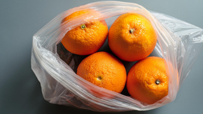
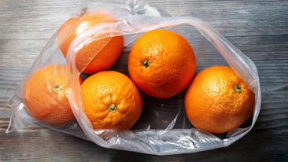
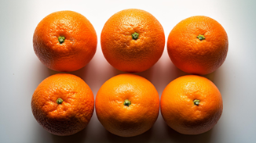

# **Processamento Digital de Imagem - Projeto de Classificação de Frutas e Legumes**

**Mestrado em Engenharia Eletrotécnica e de Computadores**  
**Mestrado em Engenharia Informática**  
**UTAD 2024/2025**

---

## **Protocolo do Projeto**

No ambiente de retalho acelerado, as mercearias buscam continuamente formas de melhorar a experiência do cliente e otimizar sua eficiência operacional. Um desafio comum é a pesagem de frutas e legumes, onde os clientes precisam inserir manualmente um código de produto ou selecionar o item correto. Este método pode ser demorado, sujeito a erros e inconveniente, resultando em filas mais longas e menor satisfação do cliente.

Para enfrentar estes desafios, uma empresa de retalho pretende desenvolver um sistema de classificação de imagens automatizado que possa identificar através de imagem com elevada precisão diferentes frutas e legumes em tempo real, eliminando a necessidade de introdução manual dos dados. Desta forma, os clientes apenas terão de colocar as frutas ou legumes na balança e o sistema através da análise de imagem efetuará a classificação dos produtos e emitirá a etiqueta com o peso e o preço. Este sistema irá acelerar o processo de pesagem e minimizar a probabilidade de erros de introdução dos dados.

Este projeto consiste em três etapas principais:

### **Etapa 1: Criação do Dataset**
- Recolha de um conjunto de dados constituído por, pelo menos, 150 imagens de cinco classes distintas de frutas e legumes (por exemplo, laranjas, limões, maçãs, pêras ou cebolas, batatas, cenouras e cogumelos). Estas imagens devem ser obtidas por cada estudante.
- As imagens devem ser capturadas principalmente sob um ângulo de topo, uma vez que esta é a perspetiva da câmara do sistema.
- O conjunto de dados deve incluir imagens capturadas em diferentes condições de iluminação, de modo a garantir que o modelo consegue generalizar bem e manter uma elevada precisão em vários ambientes.
- A plataforma Roboflow deve ser utilizada para anotar e normalizar as imagens. (colocar link)

### **Etapa 2: Treino do Modelo**
- Treinar um modelo de deep learning, mais concretamente a arquitetura ResNet-50, utilizando o dataset construído. 
- O treino do modelo pode ser efetuado em Matlab ou Python, mais especificamente na plataforma Google Colab. 
- As métricas de desempenho do modelo treinado, incluindo a matriz de confusão, a acurácia e a precisão, devem ser guardadas. Estas métricas serão essenciais para avaliar a eficácia do modelo e identificar áreas que necessitem de melhoria. 

### **Etapa 3: Comparação de Desempenho de Modelos**
- Para além do modelo ResNet-50, selecione pelo menos dois outros modelos de deep learning (por exemplo, MobileNet, VGG16, InceptionV3 ou Transformer) e treine-os com o mesmo conjunto de dados.
- Compare o desempenho de todos os modelos treinados com base nas principais métricas, identificando os pontos fortes e fracos de cada um.
- Fazer o treino e a avaliação de um modelo no dataset global obtido na turma e com dez categorias frutas/legumes.

---

## **Diagrama de Desenvolvimento do Projeto**

## **Exemplo de Imagens que devem compor o Dataset**

| Classe  | Imagens                    |
| ------- | -------------------------- |
| Maçã    |    |
| Laranja |    |

---

## **Links Úteis**

- [Roboflow](https://roboflow.com/)  
- [Google Colab](https://colab.research.google.com/)  
- [Matlab Deep Learning Model Hub](https://github.com/matlab-deep-learning/MATLAB-Deep-Learning-Model-Hub)  
- [Roboflow Notebooks](https://github.com/roboflow/notebooks)  

---

## **Avaliação**

- **Etapa 1 (10%) - 29 de novembro**: Entrega do dataset anotado.
- **Etapa 2 (60%) - 20 de dezembro**: Apresentação em PowerPoint com resultados de um modelo.
- **Etapa 3 (30%) - 8 de janeiro**: Apresentação de PowerPoint com resultados comparativos entre os diferentes implementados.

Os trabalhos podem ser realizados por grupos de 2 ou 3 alunos. O código fonte da implementação do projeto e a apresentação PowerPoint usada para reportar os principais resultados e conclusões do trabalho devem submetidos no InforEstudante. A apresentação do trabalho e a respetiva submissão no InforEstudante pode ser feita na última aula do semestre ou na data das avaliações por exame.
